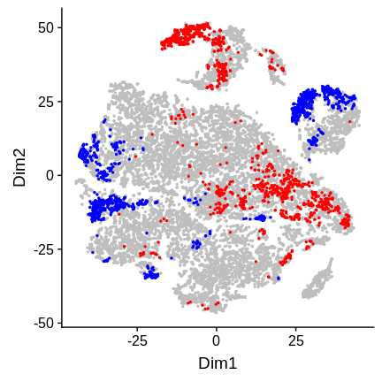
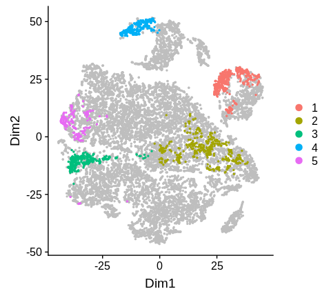
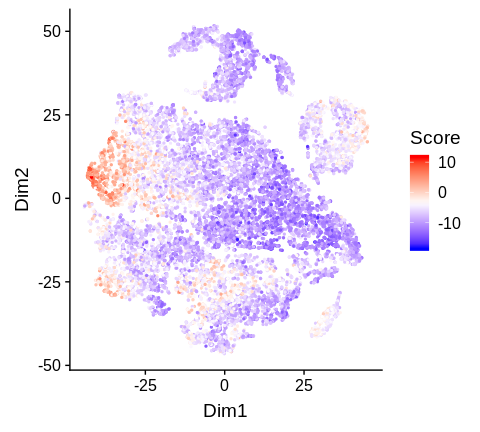

### Overview

This tutorial shows basic steps to run DAseq on scRNA-seq datasets.

Data used in this tutorial is from [Sade-Feldman, Moshe, et al. (Cell.
2018)](https://www.sciencedirect.com/science/article/pii/S0092867418313941).
The goal is to compare immune cells from melanoma patients that respond
or not respond to immune checkpoint therapy: responders (R) and
non-responders (NR), and identify cell subpopulations with differential
abundance (DA) between them.

With DAseq, five DA cell subpopulations are detected and characterized.

``` r
library(DAseq)
```

### Set some essential Python parameter

Set Python to use, put the PATH to your Python binary here

``` r
python2use <- "/path/to/your/python"
```

Set GPU to use, put the GPU number here

``` r
GPU <- 5
```

### Get label information

Here, we will get the sample label names for two biological conditions:
responders (R) and non-responders (NR) in the data, respectively. In
total, there are 48 samples, 17 of which are responders (R) and 31 of
which are non-responders (NR). This information is in the dataframe
`X.label.info` attached to the DAseq package: the label column shows the
sample label name, and the condition column shows the condition (R or
NR).

``` r
head(X.label.info)
```

    ##       label condition
    ## 1    Pre_P1         R
    ## 2   Post_P1         R
    ## 3   Post_P4         R
    ## 4 Post_P5_2         R
    ## 5    Pre_P7         R
    ## 6   Post_P7         R

Now we get the sample label names for R and NR.

``` r
R_labels <- X.label.info[X.label.info$condition == "R", "label"]
NR_labels <- X.label.info[X.label.info$condition == "NR", "label"]
```

### Get DA cells

This step incorporates the first two steps of DAseq algorithm. The input
of this step includes:

-   `X`, the scRNA-seq data after dimension reduction (PCA), this is
    included in the DAseq package as `X.melanoma`
-   `cell.labels`, sample label for every cell in the data, this is
    included in the DAseq package as `X.label.melanoma`
-   `labels.1`, sample label names that correspond to one biological
    condition (R), `R_labels`
-   `labels.2`, sample label names that correspond to the other
    biological condition (NR), `NR_labels`
-   `k.vector`, values of *k* to use for the calculation of score vector
    with *kNN*, here we will use *k* from 50 to 500
-   `plot.embedding`, 2D embedding of the data to visualize the results
    (t-SNE), this is included in the DAseq package as `X.2d.melanoma`

``` r
da.cells <- getDAcells(
  X = X.melanoma, 
  cell.labels = X.label.melanoma,
  labels.1 = R_labels, labels.2 = NR_labels,
  k.vector = seq(50,500,50),
  plot.embedding = X.2d.melanoma,
  python.use = python2use, GPU = GPU
)
```

The output of this step is a list of results:

-   `da.ratio`, score vector for each cell
-   `da.pred`, prediction values from logistic regression
-   `da.cell.idx`, index of DA cells

``` r
str(da.cells[1:3])
```

    ## List of 3
    ##  $ da.ratio   : num [1:16291, 1:10] -0.51756 0.29553 0.00342 -0.20471 -0.38711 ...
    ##   ..- attr(*, "dimnames")=List of 2
    ##   .. ..$ : NULL
    ##   .. ..$ : chr [1:10] "50" "100" "150" "200" ...
    ##  $ da.pred    : num [1:16291] 0.219 0.835 0.67 0.434 0.376 ...
    ##  $ da.cell.idx: int [1:2444] 6 8 20 21 24 27 28 29 31 34 ...

The prediction values are overlayed on the 2D embedding in the
`pred.plot` slot of the output.

``` r
da.cells$pred.plot
```


By default, cells with prediction values in the top and bottom **5%**
quantile are selected as DA cells, this can be changed by running
`updateDAcells()`. Here we change it to top and bottom **7.5%**
quantile.

``` r
da.cells <- updateDAcells(
  X = da.cells, pred.thres = c(0.075,0.925),
  plot.embedding = X.2d.melanoma
)
```

Selected DA cells are highlighted in the 2D embedding in the
`da.cells.plot` slot. Cells in red are in the top quantile, blue in the
bottom.

``` r
da.cells$da.cells.plot
```



### Get DA regions

In this step, selected DA cells will be clustered into several DA
regions with outlier removal. Several input parameters are identical to
that of `getDAcells()`:
`X, cell.labels, labels.1, labels.2, plot.embedding`.

Other input includes:

-   `cell.idx`: the `da.cell.idx` slot of the output of `getDAcells()`
-   `k`: number of clusters, this will be defined by the user, here we
    use `k=5`
-   `alpha`: the proportions of DA cells to be removed as outliers

``` r
da.regions <- getDAregion(
  X = X.melanoma, 
  cell.labels = X.label.melanoma,
  labels.1 = R_labels, labels.2 = NR_labels, 
  cell.idx = da.cells$da.cell.idx,
  k = 5, alpha = 0.25, iter.max = 30,
  plot.embedding = X.2d.melanoma
)
```

The output is a list of results:

-   `cluster.res`, clustering result of DA cells, 0 means outlier cells
-   `DA.stat`, statistics of each DA region

``` r
str(da.regions[1:2])
```

    ## List of 2
    ##  $ cluster.res: num [1:2444] 0 0 0 0 0 0 0 0 0 0 ...
    ##  $ DA.stat    : num [1:5, 1:3] -0.96 0.991 -0.973 1 -0.941 ...
    ##   ..- attr(*, "dimnames")=List of 2
    ##   .. ..$ : NULL
    ##   .. ..$ : chr [1:3] "DA.score" "pval.wilcoxon" "pval.ttest"

Clustering result is shown in the plot: `da.region.plot` slot.

``` r
da.regions$da.region.plot
```



### Get markers for each DA region with STG

The final step of DAseq is to characterize each DA region by detecting
genes that seprate the DA region from the rest of the cells through STG
(stochastic gates).

The gene expression data is NOT included in the DAseq package and needs
to be downloaded. This code will download the data to the current
working directory, and load this data into R.

``` r
download.file(
  "ftp://ftp.ncbi.nlm.nih.gov/geo/series/GSE120nnn/GSE120575/suppl/GSE120575_Sade_Feldman_melanoma_single_cells_TPM_GEO.txt.gz",
  "./GSE120575_Sade_Feldman_melanoma_single_cells_TPM_GEO.txt.gz"
)
X.data.melanoma <- read.table(
  "./GSE120575_Sade_Feldman_melanoma_single_cells_TPM_GEO.txt.gz",
  sep = "\t", header = F, row.names = 1, stringsAsFactors = F, skip = 2
)
X.data.melanoma <- as.matrix(X.data.melanoma[,-16292])
```

Then, we will use STG to identify markers for each DA region. The input
parameters for STG are the normalized gene expression matrix, DA cell
index and clustering result of DA cells.

``` r
da.STG <- STGmarkerFinder(
  X = X.data.melanoma,
  cell.idx = da.cells$da.cell.idx,
  da.region.label = da.regions$cluster.res,
  return.model = T,
  python.use = python2use, GPU = GPU
)
```

The output is a list of results:

-   `da.markers`, a list of data frames, each data frame contains
    markers for each DA region
-   `accuracy`, accuracy of STG for each DA region
-   `model`, the actual model from STG for each DA region, please refer
    to the documentation of `STGmarkerFinder()`

Top markers for DA region 2 are shown:

``` r
head(da.STG$da.markers[["2"]])
```

    ##            gene avg_logFC       p_value
    ## VCAM1     VCAM1 2.4366302 7.529967e-218
    ## NKG7       NKG7 1.1040795 5.599656e-131
    ## PRF1       PRF1 1.2723404 1.248822e-127
    ## HAVCR2   HAVCR2 1.4873059 4.146100e-118
    ## TNFRSF9 TNFRSF9 1.6964532 4.984804e-106
    ## CCL5       CCL5 0.8431577 1.679223e-103

In the `model` slot, predictions from STG are available. These
predictions are linear combinations of a limited set of genes that best
separate the DA region from the rest of the cells.

For example, here we will plot the prediction value from STG for DA
region 5: the `pred` slot of the 5th list in the `model` slot of the
output.

``` r
plotCellScore(
  X = X.2d.melanoma, score = da.STG$model[["5"]]$pred
)
```


